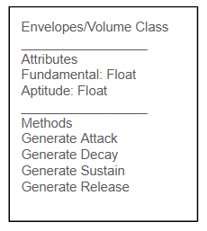

# Requirments:
1) Able to export audio via mp3 file. 
2) play audio through laptop's sound system. 
3) Produce 12 notes of a western chromatic scale in equal temperament
4) Utilizes 2 or 3 oscillators to synthesize multiple frequencies
5) Can amplify the frequencies and convert them to sound
6) Untilize presets major scale in any key
7) Utalize preset of minor scales in any key
8) Utlize preset of major pentatoinic
9) Utilizes filters, LFOs and envelopes for timbral construction
10) The user interface should allow users to control parameters through intuitive sliders and knobs.

# Classes and Methods 

## UI
Modules which are about the UI and resolve requriments 

**Key_Input Class(Requriment 11)**
Attributes: 
- key_map
- active_keys

**Methods:**
- Setup for Key Map
    - input:
          - Scale: string
          - Base Frequency: float
    - output:
          - none
    - Preconditons: 
        - Scale is not NULL and matches a supported preset or scale type
        - Base Frequency is a positive float
        - The keyboard layout to be mapped has been defined
    - Postcondtions (success):
        - `key_map` contains a valid mapping from keyboard keys to frequencies in the selected scale
        - The mapped frequencies are calculated relative to the Base Frequency
        - `active_keys` is empty before new input begins
    - Postcondtions (fail): 
        - `key_map` remains empty or unchanged
        - No invalid or partial mapping is stored

- On Press (key)
    - input:
        - key
    - output:
        - none
    - Preconditons: 
        - `key` exists in `key_map`
        - The audio generation system is initialized
        - `key` is not already marked as active
    - Postcondtions (success):
        - `key` is added to `active_keys`
        - The frequency assigned to `key` is sent to the envelope / overtone generation modules
        - Audio playback for that note begins
    - Postcondtions (fail): 
        - `active_keys` is unchanged
        - No note is started for an unmapped or invalid key

- On Release (key)
    - input:
        - 'key'
    - output:
        - none
    - Preconditons: 
        - `key` is currently in `active_keys`
        - A note is currently being played for that key
    - Postcondtions (success):
        - `key` is removed from `active_keys`
        - The release envelope is applied to the note
        - Audio for that key stops after the release phase completes
    - Postcondtions (fail): 
        - `active_keys` is unchanged
        - No playing note is modified when the key was not active

- Start Listener
    - input:
        - none
    - output:
        - none
    - Preconditions:
        - The keyboard listener is not already running
        - Event handlers (on_press, on_release) are defined
        - 'pynput' is properly installed and accessible
    - Postconditions (success):
        - Keyboard listener is started
        - System begins capturing key press and release events asynchronously
    - Postconditions (fail):
        - Listener remains inactive
        - No input events are captured

- Stop Listener
    - input:
        - none
    - output:
        - none
    - Preconditions:
        - Keyboard listener is currently running
    - Postconditions (success):
        - Keyboard listener is stopped
        - No further key events are processed
    - Postconditions (fail):
        - Listener state remains unchanged
        - System may continue capturing input

- Get Active Notes
    - input:
        - none
    - output:
        - List of frequencies (List<float>)
    - Preconditions:
        - 'key_map' has been initialized
    - Postconditions (success):
        - Returns a list of frequencies corresponding to keys in active_keys
        - Returned list accurately reflects current pressed keys
    - Postconditions (fail):
        - Returns an empty list if no keys are active
        - No internal state is modified

- Is Key Active (key)
    - input:
        - 'key'
    - output:
        - Boolean (True / False)
    - Preconditions:
        - 'key' is a valid keyboard key object or identifier
    - Postconditions (success):
        - Returns True if 'key' is in 'active_keys'
        - Returns False otherwise
    - Postconditions (fail):
        - Returns False if 'key' is invalid or not tracked
        - No internal state is modified

- Clear Active Keys
    - input:
        - none
    - output:
        - none
    - Preconditions:
        - None (can be called at any time)
    - Postconditions (success):
        - 'active_keys' is emptied
        - All currently playing notes are stopped immediately (panic/reset behavior)
        - Any active envelopes are terminated or forced into release
    - Postconditions (fail):
        - If clearing fails, 'active_keys' may remain partially unchanged
        - Some notes may continue playing (undesired state)

**Number_Input Class**
**(Requirement 10)**

- Attributes
    - current_input
    - value
    - is_active
 
**Methods:**

- Start Input
    - input:
        - none
    - output:
        - none
    - Preconditions:
        - The system is ready to accept numeric input
        - No conflicting input mode is active
    - Postconditions (success):
        - is_active is set to True
        - current_input is initialized or cleared
        - System begins capturing numeric input
    - Postconditions (fail):
        - is_active remains False
        - No input is captured

- Stop Input
    - input:
        - none
    - output:
        - none
    - Preconditions:
        - Numeric input mode is currently active
    - Postconditions (success):
        - is_active is set to False
        - Input buffer is preserved or finalized
    - Postconditions (fail):
        - is_active remains True
        - Input mode continues unintentionally

- Add Digit (digit)
    - input:
        - digit (string or character, e.g., '0'–'9', '.', '-')
    - output:
        - none
    - Preconditions:
        - is_active is True
        - digit is a valid numeric character
        - Input buffer has not exceeded maximum allowed length (if defined)
    - Postconditions (success):
        - digit is appended to current_input
        - current_input remains a valid numeric string format
    - Postconditions (fail):
        - current_input is unchanged
        - Invalid characters are ignored

- Remove Last
    - input:
        - none
    - output:
        - none
    - Preconditions:
        - is_active is True
        - current_input is not empty
    - Postconditions (success):
        - Last character is removed from current_input
        - Postconditions (fail):
        - current_input remains unchanged if empty

- Clear
    - input:
        - none
    - output:
        - none
    - Preconditions:
        - none
    - Postconditions (success):
        - current_input is reset to an empty string
        - value is reset to None (or default state)
    - Postconditions (fail):
        - Previous input may persist (undesired state)

- Parse Value
    - input:
        - none
    - output:
        - Parsed number (float or int) OR None
    - Preconditions:
        - current_input is not empty
        - current_input is in a valid numeric format
    - Postconditions (success):
        - value is updated with parsed numeric value
        - Returned value matches parsed result
    - Postconditions (fail):
        - value remains unchanged or set to None
        - Invalid format is safely handled (no crash)

- Set Value (value)
    - input:
        - value (float or int)
    - output:
        - none
    - Preconditions:
        - value is a valid numeric type
        - value is within acceptable range (e.g., valid frequency range if applicable)
    - Postconditions (success):
        - value is stored internally
        - current_input may be updated to reflect this value
    - Postconditions (fail):
        - Internal value remains unchanged
        - Invalid values are rejected

- Get Value
    - input:
        - none
    - output:
        - Current numeric value OR None
    - Preconditions:
        - None
    - Postconditions (success):
        - Returns the current value stored in value
        - Postconditions (fail):
        - Returns None if no valid value exists
        - No internal state is modified

- Is Valid
    - input:
        - none
    - output:
        - Boolean (True / False)
    - Preconditions:
        - value is not None
    - Postconditions (success):
        - Returns True if value is within allowed constraints (e.g., 20Hz–20kHz)
        - Returns False otherwise
    - Postconditions (fail):
        - Returns False if value is None or invalid
        - No internal state is modified

## Sound Production 
Moduels which are about the production of noise. 

**Generate Audio Data classes:**

**Evelopes/Volume/ Class (Requriemnts 4, 9)**

Attributes:
- Fundemtnal: Float
- Aptidue: Float 

**Methods:** 
- Generate Attack 
    - input
        -  Fundemtnal: Float
        - Aptidue: Float 
    - output 
        - Aduio_Data: List
    - Preconditons: 
        - Fundemtnal is a positive float
        - Aptidue is a non-negative float within the supported output range
        - Attack duration and sample rate have been defined
    - Postcondtions (Success):
        - `Aduio_Data` is returned as a non-empty list of samples
        - The waveform amplitude rises from 0 toward the target Aptidue
        - The waveform is generated at the given Fundemtnal
    - Postcondtions (fail): 
        - No valid sample list is produced
        - The generated data does not represent an increasing attack phase

- Generate Decay 
    - input
        -  Fundemtnal: Float
        - Aptidue: Float 
    - output 
        - Aduio_Data: List
    - Preconditons: 
        - Fundemtnal is a positive float
        - Aptidue is a non-negative float within the supported output range
        - Decay duration and sustain target have been defined
    - Postcondtions (Success):
        - `Aduio_Data` is returned as a non-empty list of samples
        - The waveform amplitude decreases from the attack peak toward the sustain level
        - The waveform remains based on the given Fundemtnal
    - Postcondtions (fail): 
        - No valid sample list is produced
        - The generated data does not represent a decreasing decay phase

- Generate sustain
    - input
        -  Fundemtnal: Float
        - Aptidue: Float 
    - output 
        - Aduio_Data: List
    - Preconditons: 
        - Fundemtnal is a positive float
        - Aptidue is a non-negative float within the supported output range
        - Sustain duration has been defined
    - Postcondtions (Success):
        - `Aduio_Data` is returned as a non-empty list of samples
        - The waveform maintains a stable amplitude near the sustain level
        - The waveform remains based on the given Fundemtnal
    - Postcondtions (fail): 
        - No valid sample list is produced
        - The generated data does not hold a stable sustain phase

- Generate Relase
    - input
        -  Fundemtnal: Float
        - Aptidue: Float 
    - output 
        - Aduio_Data: List
    - Preconditons: 
        - Fundemtnal is a positive float
        - Aptidue is a non-negative float within the supported output range
        - Release duration has been defined
    - Postcondtions (Success):
        - `Aduio_Data` is returned as a non-empty list of samples
        - The waveform amplitude decreases smoothly to 0
        - The note is ready to stop without an abrupt cutoff
    - Postcondtions (fail):
        - No valid sample list is produced
        - The generated data does not fade to 0 at the end of the release

**Overtones Class:(Requriemnts 4, 9)**

Atributes: 
- Fundmental: Float 

Methods: 
- generate_harmonics
    - Input: 
        - Fundemtal: Float
    - Output:
        - Harmonics: List
    - Preconditons: 
        - Fundemtal is a positive float
        - The number of harmonic partials to generate has been defined
    - Postcondtions (Success):
        - `Harmonics` is returned as a non-empty list
        - Each harmonic frequency is an integer multiple of the Fundemtal
        - The harmonic list is ordered from lower to higher frequency
    - Postcondtions (fail): 
        - No valid harmonic list is returned
        - Returned frequencies are not consistent multiples of the Fundemtal

- generate_overtones
    - Input: 
        - Fundemtal: Float
    - Output:
        - ovetones: List 
    - Preconditons: 
        - Fundemtal is a positive float
        - A harmonic / timbre profile is available for overtone generation
    - Postcondtions (Success):
        - `ovetones` is returned as a non-empty list
        - The list contains overtone frequencies derived from the Fundemtal
        - The overtone data can be passed to the oscillator mix or envelope stage
    - Postcondtions (fail): 
        - No valid overtone list is returned
        - Returned frequencies are not consistent with the Fundemtal or selected profile
    
- fetch_overtones
    - Input: 
        - Instrument: String
    - Output
        - Overtones
    - Preconditons: 
        - Instrument is not NULL
        - Instrument matches a supported preset or stored overtone profile
    - Postcondtions (Success):
        - A valid overtone profile is returned for the requested Instrument
        - The returned profile can be used by `generate_overtones`
    - Postcondtions (fail): 
        - No overtone profile is returned, or a default / empty profile is returned
        - No unsupported Instrument profile is stored as valid

**Generate_Preset classes: (Reqirements 3, 6, 7, 8)**

Methods
- Calcuate_Scale
    - Inputs 
        - home_tone: float
        - mode: String (defult = major)
    - Output 
        - frequency_list: list/array
- Preconditons: 
    - home_tone NOT NULL
    - home_tone is a positive float
    - mode is one of the supported values (major, minor, pentatonic, chromatic)
- Postconitons (success)
    - Outputs a list of frequenices in line withe the modal scale
    - The frequencies are ordered from lowest to highest
    - The list is calculated from `home_tone` using equal temperament intervals
- Postcondtions(fail)
    - Outputls a list of frequenices not in line with the modal scale
    - dose not output a list
   

## UI and Generation Connections Class (Requrments 1, 3,6,7,8,9,10,11)
**Methods:**
- Assign to Computer_keyboards 
    - input 
        - frequency_list: list/array
    - output 
        - void
    - Preconditons: 
        - frequency_list: NOT NULL
        - `frequency_list` contains positive frequency values
        - Enough keyboard keys are available for the assignment pattern
    - Post condtions (success)
        - The computer keys are assigned new numbers in accending order and by designated pattern
        - Each assigned key maps to exactly one frequency in `frequency_list`
    - Post condtions (fail)
        - The computer keys are not assgined new numbers
        - The computer key are assigned number in a non- accending order. 

- Record: 
    - input: 
        - audio_data: audio samples 
    - output
        - wav file
    - Preconditons: 
        - `audio_data` is not NULL
        - `audio_data` contains valid audio samples
        - A file name or export path has been provided
    - Postcondtions (Success):
        - A valid audio file is written to disk from `audio_data`
        - The saved file can be opened and played back
    - Postcondtions (fail): 
        - No file is created, or the file is incomplete / unreadable
        - The original `audio_data` remains unchanged
# Relationship Diagram

()

# Notes 

All uese of `num_input` are curently place holders for knobs or sliders. On the mathmatic side of sound, all inputs are a float between 0 and 1, so all sliders and knobs input some float. 

Ocilateros, filters, LFOs and timbral construction are all the same thing. In musical terms, they all are about chaning the timber of a sound. Timber is how we can tell what produces a noise, how we know the diffrence between a piano, violin, or electric gituar. These were orginaly conceptulized as sperate requriments, due to them often being taught in isolation as older alalog sythiszers needed them to be seprate. But now in digital sythisizers they are all done through the same process, but often still kept seprate in order to fall in line with musical traditon. 

The use of presets also covers muliple requriments, as they were all secretely the same process. Requriment 3 "Produce 12 notes of a western chromatic scale in equal temperament" is about creating a list of 12 frequeinces, each spaced equaly apart where the lowest and highest notes are in a 2:1 ratio. This produces the scale you get by hitting all the keys on a piano. Major, minor, and pentatonic scales are just selection of these 12 notes. 

There are two methods we use for these. The fetch version of the method would assign the stadard musical 12 notes used by nearly every western instrument, while calculate could take any number as the home tone (the lowest and highest note in the scale) to be any number, irregradelss if it's weird or not recomended. 

Most of our non-functional requriemtns have not been directly labled, as they have to do with technical preformance, and so will show up durring the implemnation phase. 
