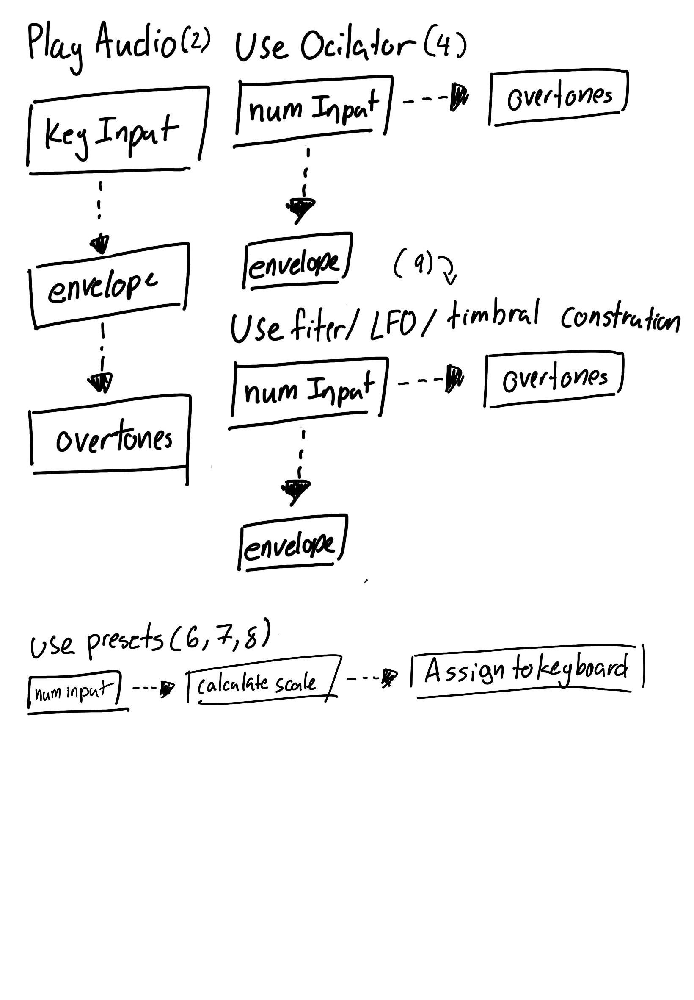

# TO DO: 
- UML 
- UI Methods
- Pre and Post condtions 
- Class Diagram 
# Requirments:
1) Able to export audio via mp3 file. 
2) play audio through laptop's sound system. 
3) Produce 12 notes of a western chromatic scale in equal temperament
4) Utilizes 2 or 3 oscillators to synthesize multiple frequencies
5) Can amplify the frequencies and convert them to sound
6) Untilize presets major scale in any key
7) Utalize preset of minor scales in any key
8) Utlize preset of major pentatoinic
9) Utilizes filters, LFOs and envelopes for timbral construction
10) The user interface should allow users to control parameters through intuitive sliders and knobs.
15) The application should support standard laptop audio hardware and drivers.

# Classes and Methods 

## UI
Modules which are about the UI and resolve requriments 

Key_Input Class

Number_Input Class

Display Class

## Tutorial Pages (multpile classes)

## Sound Production 
Moduels which are about the production of noise

**Generate Audio Data classes: (Reqirements 1, 2)**
Methods that generate the audio data

**Evelopes/Volume/ Class**

Attributes:
- Fundemtnal: Float
- Aptidue: Float 

**Methods:** 
- Generate Attack 
    - input
        -  Fundemtnal: Float
        - Aptidue: Float 
    - output 
        - Aduio_Data: List
- Generate Decay 
    - input
        -  Fundemtnal: Float
        - Aptidue: Float 
    - output 
        - Aduio_Data: List
- Generate sustain
    - input
        -  Fundemtnal: Float
        - Aptidue: Float 
    - output 
        - Aduio_Data: List
- Generate Relase
    - input
        -  Fundemtnal: Float
        - Aptidue: Float 
    - output 
        - Aduio_Data: List
- Preconditons: 
- Postcondtions (Success):
- Postconditons (fail):

**Overtones Class:**

Atributes: 
- Fundmental: Float 

Methods: 
- generate_harmonics
    - Input: 
        - Fundemtal: Float
    - Output:
        - Harmonics: List 
- generate_overtones
    - Input: 
        - Fundemtal: Float
    - Output:
        - ovetones: List 
- fetch_overtones
    - Input: 
        - Instrument: String
    - Output
        - Overtones
- Preconditons: 
- Postcondtions (Success):
- Postconditons (fail): 

Filter Class

**Generate Preset classes: (Reqirements 1, 2)**
Take Audio data and calcuate them for presets

Methods
- Calcuate_Scale
    - Inputs 
        - home_tone: float
        - mode: String (defult = major)
    - Output 
        - frequency_list: list/array
- Preconditons: 
    - home_tone NOT NULL
- Postconitons (success)
    - Outputs a list of frequenices in line withe the modal scale
- Postcondtions(fail)
    - Outputls a list of frequenices not in line with the modal scale
    - dose not output a list
   

## UI and Generation Connections

- Assign to Computer_keyboards 
    - input 
        - frequency_list: list/array
    - output 
        - void
    - Preconditons: 
        - frequency_list: NOT NULL
    - Post condtions (success)
        - The computer keys are assigned new numbers in accending order and by designated pattern
    - Post condtions (fail)
        - The computer keys are not assgined new numbers
        - The computer key are assigned number in a non- accending order. 

## Others 
- Record: 
    - input: 
        - audio_data?
    - output
        - wav file? 

# Relationship Diagram

()